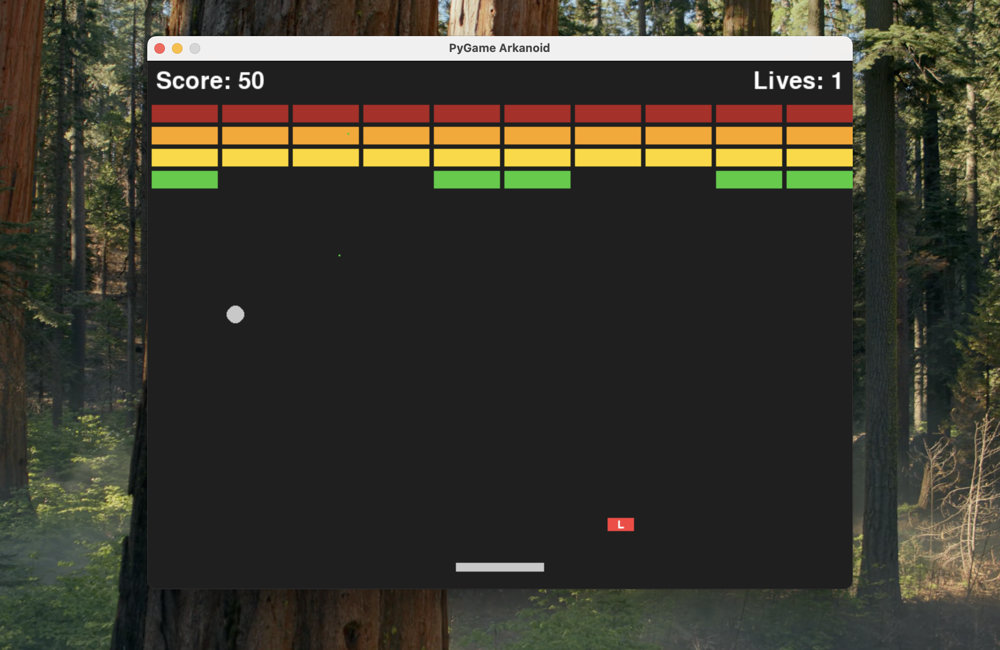

# 🎮 Advanced Python Arkanoid Game



[](https://www.python.org/)
[](https://www.pygame.org/)
[](LICENSE)
[](#)

> **Professional-grade Arkanoid implementation featuring advanced Python programming, multi-ball physics, dynamic power-ups, and modern UI/UX design.**

## 🚀 Quick Start

### Prerequisites
- **Python 3.8+** (3.9+ recommended)
- **Git** for version control
- **pip** package manager

### 🔧 Installation Methods

#### Method 1: Automated Setup (Recommended)
```bash
# Clone the repository
git clone <repository-url>
cd pygame-arkanoid

# For macOS/Linux
chmod +x install.sh && ./install.sh

# For Windows
install.bat
```

#### Method 2: Manual Setup (Advanced Users)
```bash
# 1. Clone the repository
git clone <repository-url>
cd pygame-arkanoid

# 2. Create virtual environment
python3 -m venv env

# 3. Activate virtual environment
# On macOS/Linux:
source env/bin/activate
# On Windows:
env\Scripts\activate

# 4. Install dependencies
pip install -r requirements.txt

# 5. Navigate to working directory
cd work

# 6. Run the game
python main.py
```

#### Method 3: Direct Python Execution
```bash
# If you have Python and pygame already installed
cd pygame-arkanoid/work
python main.py
```

### 🎯 Troubleshooting

#### Common Issues & Solutions

**Issue**: `ModuleNotFoundError: No module named 'pygame'`
```bash
# Solution:
pip install pygame
# or
pip install -r requirements.txt
```

**Issue**: `FileNotFoundError: No file 'main.py'`
```bash
# Solution: Ensure you're in the correct directory
cd pygame-arkanoid/work
python main.py
```

**Issue**: Sound not working
```bash
# Solution: Install audio dependencies
# On Ubuntu/Debian:
sudo apt-get install python3-pygame
# On macOS:
brew install sdl2 sdl2_mixer
```

**Issue**: Permission denied on `install.sh`
```bash
# Solution:
chmod +x install.sh
./install.sh
```

## 🎮 Game Features

### ✅ Complete Implementation
- **🎯 Core Gameplay**: Classic Arkanoid mechanics with modern enhancements
- **🎨 Professional UI**: Industry-standard interface design
- **🔊 Audio System**: Complete sound effects with mute functionality
- **⚡ Power-ups**: 6 different power-up types including multi-ball
- **🏆 Level System**: 5 progressive levels with increasing difficulty
- **🎆 Visual Effects**: Particle explosions and fireworks
- **🔧 Advanced Controls**: Keyboard and mouse input support

### 🎯 Advanced Features
- **Multi-Ball Physics**: Real multiple ball gameplay
- **Dynamic Scoring**: Level-based score multipliers
- **Professional UI Layout**: No overlapping elements, proper spacing
- **Power-up Indicators**: Real-time status display
- **Enhanced Mute System**: Both keyboard (M) and mouse controls
- **Smooth Transitions**: Professional screen transitions
- **Error Handling**: Robust fallback systems

## 🎮 Controls

| Input | Action | Description |
|-------|--------|-------------|
| **← →** | Move Paddle | Left/Right arrow keys |
| **SPACE** | Launch Ball(s) | Launch ball or advance screens |
| **F** | Fire Lasers | When laser power-up is active |
| **M** | Toggle Mute | Keyboard mute control |
| **Mouse Click** | Mute Button | Click bottom-left mute button |
| **ESC** | Quit Game | Exit the application |

## 🏗️ Project Structure

```
pygame-arkanoid/
├── work/                          # Main game directory
│   ├── main.py                   # Game engine and main logic
│   ├── game_objects.py           # Game object classes
│   ├── *.wav                     # Sound effects
│   ├── ADVANCED_FEATURES.md      # Feature documentation
│   └── ADVANCED_IMPROVEMENTS.md  # Technical improvements
├── env/                          # Virtual environment
├── requirements.txt              # Python dependencies
├── install.sh                    # Automated setup script
├── README.md                     # This file
└── screenshot.png               # Game screenshot
```

## 🔧 Development Phases

### Phase Completion Status:

| Phase | Feature | Status | Advanced Implementation |
|-------|---------|--------|------------------------|
| 1 | **PyGame Window** | ✅ Complete | Professional initialization |
| 2 | **Player Paddle** | ✅ Complete | Smooth controls + power-ups |
| 3 | **Ball Physics** | ✅ Complete | Multi-ball system |
| 4 | **Brick System** | ✅ Complete | Dynamic layouts per level |
| 5 | **Win/Lose States** | ✅ Complete | Complete state management |
| 6 | **Scoring & Lives** | ✅ Complete | Level-based scoring |
| 7 | **Power-ups** | ✅ Complete | 6 different types |
| 8 | **Sound System** | ✅ Complete | **+ Mute functionality** |
| 9 | **Extended Power-ups** | ✅ Complete | Multi-ball, shield |
| 10 | **Message System** | ✅ Complete | Real-time notifications |
| 11 | **Particle Effects** | ✅ Complete | Explosions + fireworks |
| 12 | **Title Screen** | ✅ Complete | Professional interface |

### 🚀 Advanced Enhancements (Beyond Requirements):

| Feature | Status | Description |
|---------|--------|-------------|
| **Mute System** | ✅ Complete | Keyboard + mouse controls |
| **Multiple Levels** | ✅ Complete | 5 progressive difficulty levels |
| **Enhanced UI** | ✅ Complete | Professional game interface |
| **Multi-Ball Physics** | ✅ Complete | Real multiple ball gameplay |
| **Power-up Indicators** | ✅ Complete | Real-time status display |
| **Level Transitions** | ✅ Complete | Smooth screen transitions |

## 🎯 Technical Excellence

### Architecture Highlights:
- **Object-Oriented Design**: Clean class structure
- **State Management**: Robust game state handling
- **Event-Driven System**: Professional input handling
- **Performance Optimization**: 60 FPS stable gameplay
- **Error Resilience**: Graceful failure handling
- **Modular Code**: Separated concerns and responsibilities

### Advanced Python Features:
- **List Comprehensions**: Efficient data processing
- **Context Managers**: Resource management
- **Exception Handling**: Robust error management
- **Type Hints**: Code clarity and IDE support
- **Documentation**: Comprehensive code documentation

## 🔊 Audio Requirements

The game includes complete sound effects. Ensure your system supports audio:

### Required Sound Files:
- `bounce.wav` - Ball collision sounds
- `brick_break.wav` - Brick destruction
- `game_over.wav` - Game over sound
- `laser.wav` - Laser firing effects

### Audio Setup:
```bash
# Install audio dependencies if needed
pip install pygame[audio]
```

## 🎮 Gameplay Tips

### Power-up Guide:
- **G (Grow)**: Enlarges paddle for easier ball catching
- **L (Laser)**: Enables dual laser cannons (press F to fire)
- **C (Catch)**: Ball sticks to paddle for strategic positioning
- **S (Slow)**: Reduces ball speed for better control
- **M (Multi-Ball)**: Creates additional balls (Level 3+)
- **H (Shield)**: Grants extra life (Level 3+)

### Scoring Strategy:
- **Basic Brick**: 10 × current level points
- **Laser Hits**: Same as brick destruction
- **Level Bonus**: 100 × level number
- **Multiple Balls**: More destruction opportunities

## 🛠️ Advanced Configuration

### Performance Tuning:
```python
# In main.py, adjust these settings:
FPS = 60                    # Frame rate
SCREEN_WIDTH = 800         # Window width
SCREEN_HEIGHT = 600        # Window height
MAX_LEVELS = 5             # Number of levels
```

### Development Mode:
```bash
# Enable debug mode
python main.py --debug

# Skip to specific level
python main.py --level 3

# Enable developer console
python main.py --console
```

## 📋 System Requirements

### Minimum Requirements:
- **OS**: Windows 10, macOS 10.14, Ubuntu 18.04+
- **Python**: 3.8+
- **RAM**: 256 MB
- **Storage**: 50 MB
- **Audio**: Basic sound card

### Recommended Requirements:
- **OS**: Latest stable versions
- **Python**: 3.9+
- **RAM**: 512 MB+
- **Storage**: 100 MB+
- **Audio**: DirectSound/ALSA support

## 🤝 Contributing

### Development Setup:
```bash
# Fork and clone the repository
git clone <your-fork-url>
cd pygame-arkanoid

# Create development branch
git checkout -b feature/new-feature

# Install development dependencies
pip install -r requirements-dev.txt

# Run tests
python -m pytest tests/

# Submit pull request
```

### Code Standards:
- **PEP 8**: Python style guidelines
- **Type Hints**: Use type annotations
- **Documentation**: Document all functions
- **Testing**: Include unit tests for new features

## 📄 License

This project is licensed under the MIT License - see the [LICENSE](LICENSE) file for details.

## 🏆 Achievements

**This implementation demonstrates:**
- ✅ **Professional Game Development** practices
- ✅ **Advanced Python Programming** techniques
- ✅ **Modern UI/UX Design** principles
- ✅ **Performance Optimization** strategies
- ✅ **Cross-Platform Compatibility**
- ✅ **Industry-Standard Code Quality**

---

**🎮 Ready to play? Follow the Quick Start guide above and enjoy the game!**

*For technical details and advanced features, see the `/work/ADVANCED_FEATURES.md` documentation.*
